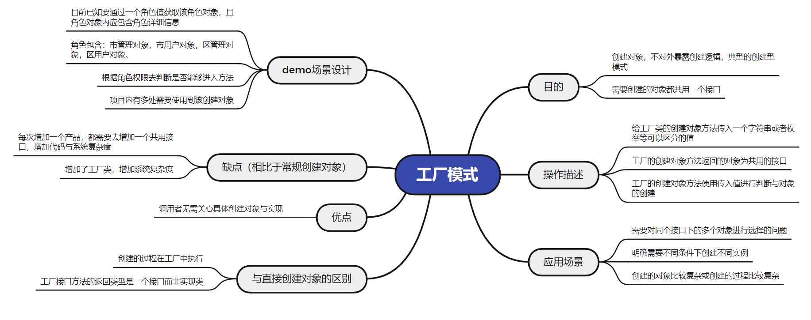
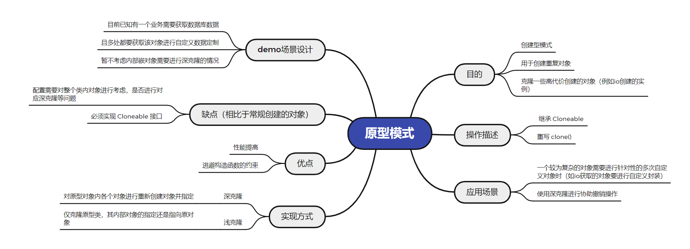

# 九大设计模式
## 简介
- 进行九大设计模式的相关demo演示，与具体实际场景应用演示

- 九大设计模式：`工厂模式`,`单例模式`,`原型模式`,`适配器模式`,`装饰模式`,`代理模式`,`观察者模式`,`策略模式`,`模板模式`

## 包说明
- pattern：各个设计模式相关demo
- test：测试位置，模式demo运行测试均在此
## 工厂模式

### 场景
1. 目前已知要通过一个角色值获取该角色对象，角色对象里有该角色的详细信息

2. 需要通过这个字符串值去决定创建：市管理对象，市用户对象，区管理对象，区用户对象。

3. 根据角色权限去判断是否能够进入方法

4. 项目内有多处需要使用到该创建方式对象，用以判断用户
### 涉及文件
- pattern.plant：普通demo
- common---UserPlant：用户工厂
- entity.common---User：用户抽象接口对象，用于定义用户实现标准
- entity.common.user---所有文件：用于定义各个用户实现
- overall---UserEnum：用户枚举，对应每个用户的枚举，具体关联关系会在用户工厂内展现

## 单例模式

### 场景
1. 目前已知需获取多个字典表数据（字典表数据在程序运行期间一般不变）

2. 全局项目皆可调用，且需线程安全

3. 普通模式创建会出现重复io问题

4. 进行普通单例类设计，与枚举类设计

### 涉及文件
- pattern.single：普通demo
- common---DictSingle：静态内部类单例
- common---DictSingleEnum：枚举单例
## 原型模式

### 场景
1. 目前已知有一个业务需要获取数据库数据

2. 且多处都要获取该对象进行自定义数据定制

3. 暂不考虑内部嵌对象需要进行深克隆的情况

### 涉及文件
- pattern.shape：普通demo
- common---DataShape：对应数据原型模式实现类
## 适配器模式

### 场景
1. 目前已知有两个方法都需要用到用户名称列表参数

2. 提供的参数统一是List<String>格式的

3. 第一个方法要求入参是","隔开，第二个方法要求入参是"@"隔开

4. 现在要求用适配器模式提供参数给两个方法入参
### 涉及文件
- pattern.adapter：普通demo
- common---SplitAdapter：场景中的适配器类
- common---AdapterOne：场景中的第一个方法
- common---Adapter Two：场景中的第二个方法
## 装饰者模式

### 场景
1. 目前已知有几个包含金额的实体类

2. 需要对这些实体类内的金额进行统一处理，保留2位小数

3. 几个实例类的金额统一使用get方法调用
### 涉及文件
- pattern.decorator：普通demo
- entity.common.money---MoneyDecorator：装饰者类
- entity.common.money---MoneyDemo：金额统一父类，主要用于统一金额子类的调用方法
- entity.common.money---MoneyOne/MoneyTwo：两个金额demo实现子类
## 代理模式
1. 传统代理模式
2. spring aop代理模式
### 场景
1. 目前已知原本有一个用户反馈方法

2. 现需要在反馈给用户信息之前对信息与用户信息进行补充处理

3. 结束反馈后需进行记录

4. 使用spring aop方式进行代理
### 涉及文件
- pattern.proxy：普通demo
- common---FeedbackProxy：被代理的用户反馈类
- common.aop---MoneyDemo：aop代理类