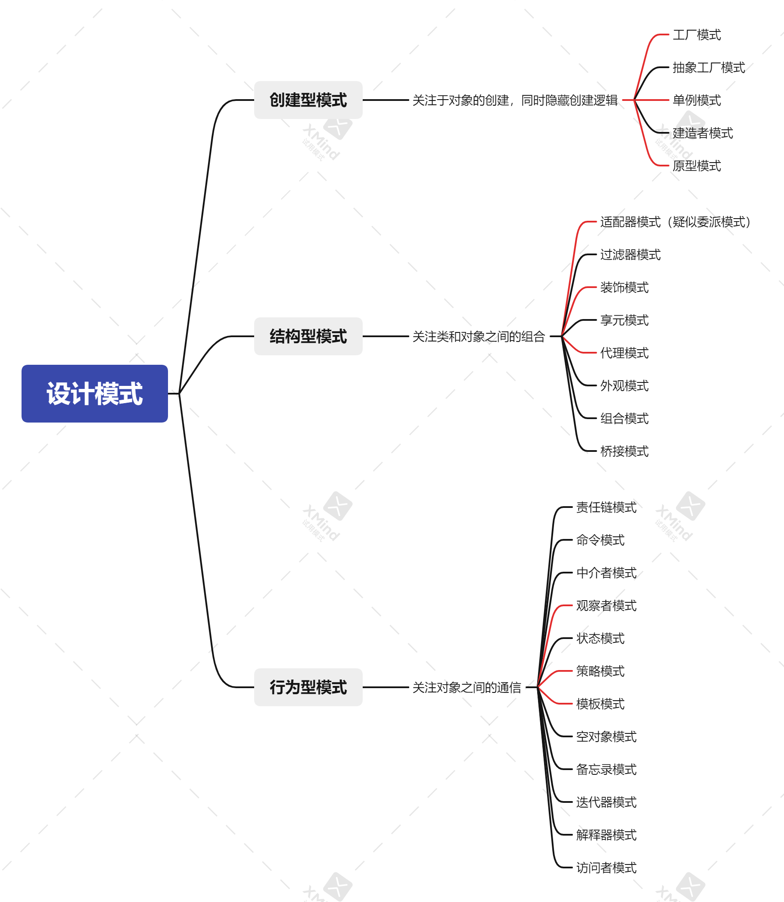

# 九大设计模式
## 简介
- 进行九大设计模式的相关demo演示，与具体实际场景应用演示

- 九大设计模式：`工厂模式`,`单例模式`,`原型模式`,`适配器模式`,`装饰模式`,`代理模式`,`观察者模式`,`策略模式`,`模板模式`

## 包说明
- pattern：各个设计模式相关demo
- test：测试位置，模式demo运行测试均在此
## 工厂模式

### 场景
1. 目前已知要通过一个角色值获取该角色对象，角色对象里有该角色的详细信息

2. 需要通过这个字符串值去决定创建：市管理对象，市用户对象，区管理对象，区用户对象。

3. 根据角色权限去判断是否能够进入方法

4. 项目内有多处需要使用到该创建方式对象，用以判断用户
### 涉及文件
- pattern.plant：普通demo
- common---UserPlant：用户工厂
- entity.common---User：用户抽象接口对象，用于定义用户实现标准
- entity.common.user---所有文件：用于定义各个用户实现
- overall---UserEnum：用户枚举，对应每个用户的枚举，具体关联关系会在用户工厂内展现
### 思维导图

## 单例模式

### 场景
1. 目前已知需获取多个字典表数据（字典表数据在程序运行期间一般不变）

2. 全局项目皆可调用，且需线程安全

3. 普通模式创建会出现重复io问题

4. 进行普通单例类设计，与枚举类设计

### 涉及文件
- pattern.single：普通demo
- common---DictSingle：静态内部类单例
- common---DictSingleEnum：枚举单例